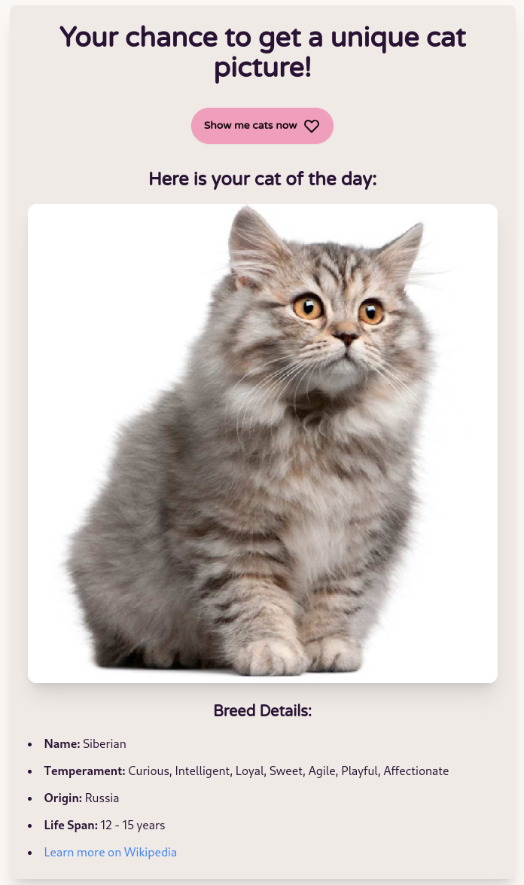

# CAT LOVERS HUB 😺

**Cat Lovers Hub** 😺 is a fun project primarily created for learning and practicing with **Tailwind CSS** and **Flask**. The application leverages the **CAT API** to display various cat images and information, and a **JOKE API** to provide cat-themed jokes for some added fun. This project allows me to enhance my web development skills while building something for fun.
And this is a tribute to the best cat in the universe : mine, **Salem**.

### **Tech Stack Used** ⚙️

- **Frontend**: Tailwind with DaisyUI components, HTML 💻  
- **Backend**: Flask, Python ⚙️

###  **Get cat's picture: no breed information but a programming joke instead** 🃏
With the CAT API and the JOKE API, you can get a random cat picture paired with a programming joke, instead of breed information, for a fun !


###  **Get cat's picture with its breed information thanks to Wikipedia** 🧾
With the **CAT API**, you can get a cat's picture along with its breed information, including a link to the Wikipedia page that provides more details about the breed.


## Acknowledgements

 - [CAT API](https://thecatapi.com/) : sign up to get an API key and create credentials for free
 - [JOKE API FOR DEV](https://v2.jokeapi.dev/) : not need for api key to use it, it's public


## Run Locally

**Clone the project:**

```bash
  git clone git@github.com:emilours/CatLoversHUB.git
```

**Install dependencies:**

```bash
    python3 -m venv .venv
    source .venv/bin/activate
    pip install flask
    pip install requests
    pip install python-dotenv
```

**Create .env and fill it with you API key:**

```bash
  AT_API_KEY="your key here"
```

**Run Locally:**

```bash
  npm install
  python CatLoverHub.py
```

**Go on localhost:**

```bash
  http://127.0.0.1:5000
```


